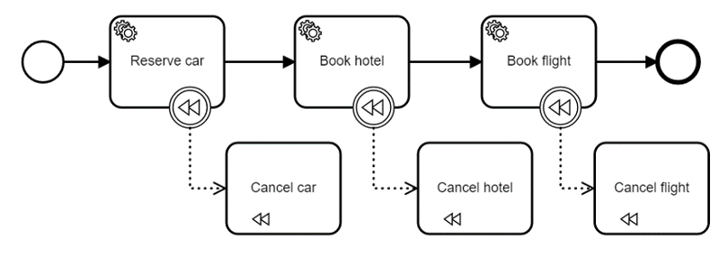

# Saga example

Example implementations of the Saga pattern for a classic example: trip booking.


The Saga pattern describes how to solve distributed (business) transactions without two-phase-commit as this does not scale in distributed systems. The basic idea is to break the overall transaction into multiple steps or activities. Only the steps internally can be performed in atomic transactions but the overall consistency is taken care of by the Saga. The Saga has the responsibility to either get the overall business transaction completed or to leave the system in a known termination state. So in case of errors a business rollback procedure is applied which occurs by calling compensation steps or activities in reverse order.

In the example hotel, car and flight booking might be done by different remote services. So there is not technical transaction, but a business transaction. When the flight booking cannot be carried out succesfully you need to cancel hotel and car. 

A more detailed look on Sagas is available online:

* [Saga: How to implement complex business transactions without two phase commit](
https://blog.bernd-ruecker.com/saga-how-to-implement-complex-business-transactions-without-two-phase-commit-e00aa41a1b1b)

# Implementation options

There are multiple options to implement a Saga. We want to add more alternative approaches here in future. So far there is only one approach implemented.

## Lightweight workflow engine (Camunda)

Using the [Camunda](https://camunda.org/) engine you can implement the Saga above, either by using graphical modeling or by specifying the same thing via a Java DSL (called Model-API). The following code uses a small custom SagaBuilder to improve readability of the Saga definition:

```
SagaBuilder saga = SagaBuilder.newSaga("trip")
        .activity("Reserve car", ReserveCarAdapter.class) 
        .compensationActivity("Cancel car", CancelCarAdapter.class) 
        .activity("Book hotel", BookHotelAdapter.class) 
        .compensationActivity("Cancel hotel", CancelHotelAdapter.class) 
        .activity("Book flight", BookFlightAdapter.class) 
        .compensationActivity("Cancel flight", CancelFlightAdapter.class) 
        .end()
        .triggerCompensationOnAnyError();

camunda.getRepositoryService().createDeployment() 
        .addModelInstance(saga.getModel()) 
.deploy();
```

The flow can also be expressed graphically using the BPMN notation (this is also auto-generated to be used in monitoring if using the DSL above):




# Get started

You need

* Java
* Maven

Required steps

* Checkout or download this project
* Run the [Application.java](src/main/java/io/flowing/trip/Application.java) class as this is a Spring Boot application running everything at once, starting exactly one Saga that is always "crashing" in the flight booking
* If you like you can access the Camunda database from the outside, e.g. using the ["Camunda Standalone Webapp"](https://camunda.org/download/) to inspect state. Use the follwing connection url: ```jdbc:h2:tcp://localhost:8092/mem:camunda;DB_CLOSE_DELAY=-1;DB_CLOSE_ON_EXIT=FALSE```. Note that you need [Camunda Enterprise](https://camunda.com/trial/) to see historical data.


